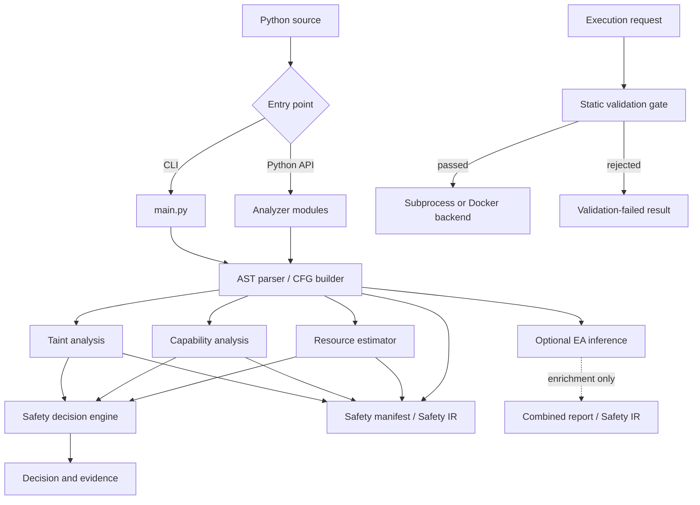

# EvoSafe Architecture

## Scope

EvoSafe is a repository-local Python static-analysis toolkit. Its analyzers consume source text or files and produce structured reports; analysis does not import or execute the program being inspected. The project also contains an execution orchestrator, which is a separate workflow that can run code only after a validation gate.

The main architectural boundary is between **safety analysis** and **optional enrichment**. Taint, capability, and resource analysis feed the safety decision. EA-role inference may be attached to a report, but it is not an input to the safety decision.

## System View



The CLI exposes AST, CFG, taint, capability, resource, manifest, and Safety IR commands. The Python API exposes those modules directly and also provides `analysis.pipeline.analyze_program` for a combined report.

## Static Analysis Flow

### Source parsing

`parser/ast_parser.py` parses Python source and provides AST serialization. Notebook-related parsing lives in `parser/notebook_execution_parser.py`. Syntax errors are surfaced rather than silently analyzed as valid programs.

### Control-flow graph

`cfg/cfg_builder.py` builds a graph representation for modules and functions. The CFG layer is used by commands and analysis components that need explicit control-flow structure. CLI output is serialized as JSON.

### Independent analysis passes

The safety analyzers are implemented as separate modules under `analysis/`:

- `analysis/taint/` identifies supported source-to-sink flows and reports paths and locations.
- `analysis/capability/` identifies filesystem, network, process, and dynamic-execution capability signals, with severity and source evidence.
- `analysis/resource/` computes heuristic metrics and flags for loop nesting, potentially unbounded loops, recursion, and call depth.

These reports are facts and signals, not verdicts by themselves. They are passed to the decision engine.

### Safety decision

`analysis/decision/engine.py` combines the taint, capability, and resource reports and evaluates optional policies. The severity ordering is:

```text
SAFE < CONDITIONALLY_SAFE < UNSAFE
```

A taint finding or dynamic-execution signal can raise the result to `UNSAFE`. Resource flags can produce `CONDITIONALLY_SAFE` or `UNSAFE`, depending on the risk and flag type. Policy hooks can impose additional requirements or denials. The result includes reasons, rule hits, and policy results.

This is a rule-based static assessment. It does not establish that arbitrary Python code is safe, and downstream systems should apply their own trust and execution controls.

## Combined Pipeline

`analysis/pipeline.py` defines `AnalysisResult` and `analyze_program`:

1. Run taint analysis.
2. Run capability analysis.
3. Run resource estimation.
4. Give those three results to `SafetyDecisionEngine`.
5. Optionally run EA inference when `include_ea=True`.
6. Merge and order evidence for serialization.

The safety decision is computed before optional EA enrichment and receives no EA-role findings. `include_ea` defaults to `False`.

## Optional EA-Role Inference

The EA analyzer is under `analysis/ea_inference/`. It is framework-independent and reports structural evidence for seven roles: population, fitness evaluation, selection, mutation, crossover, replacement, and termination.

Current analysis layers:

1. The source AST and CFG references provide syntax locations and control context.
2. `IntraProceduralDataFlow` tracks simple bindings, aliases, collection mutations, local helper summaries, and registration/dispatch relationships.
3. `_structure.py` builds source-located collection facts, candidate facts, and lineage facts on top of those existing data-flow summaries.
4. Existing role detectors consume structural facts alongside conservative syntax checks and helper/dispatch evidence.
5. `EAInferenceReport` stores findings, evidence, confidence, and termination classification.

The structural model includes `CollectionFact`, `CandidateFact`, and `CandidateLineageFact`. Collection operations include construction, alias, copy, iteration, index/slice access, append/extend/insert, mutation, reassignment, and replacement. Candidate relations include element-of-collection, alias/copy, derived-from-one or two candidates, mutation, return, insertion, selection, and replacement.

Two-input lineage requires two distinct candidate-derived sources and a locally supported value relationship. Function names such as `cross` or `combine` are not sufficient evidence. Explicit copies preserve candidate ancestry; arbitrary calls do not imply a copy. Unresolved calls, ambiguous branch aliases, and indices that cannot be proven distinct are kept conservative.

Confidence is ordinal evidence strength (`HIGH`, `MEDIUM`, or `LOW`), not a calibrated probability. This subsystem is incomplete: it does not model all Python heap behavior, dynamic dispatch, or arbitrary interprocedural flows. EA inference is descriptive metadata and must not be used as a safety verdict.

## Safety Manifest

`analysis/manifest/` generates and verifies deterministic safety manifests. Canonicalized report content is hashed to provide an integrity digest. The verifier checks the digest and manifest structure; a valid digest confirms integrity of the manifest payload, not the safety of the source program.

## Safety IR

`analysis/safety_ir/` combines source shape, CFG information, taint flows, capabilities, safety facts, decision data, and evidence into the project’s structured IR model. Its builder invokes the established safety analyzers and recomputes the decision from their reports. EA-role data is optional and represented as enrichment when enabled; it does not alter `verdict_hint`.

The IR is intended for downstream tooling and serialized as JSON. Its metadata records modeling scope and analysis summaries. It is not a complete semantic model of Python; dynamic behavior and unsupported language features remain outside the modeled subset.

## CLI and API Boundaries

`main.py` is a thin command dispatcher. Each CLI command accepts either a source file or inline source via `--src`. Commands emit JSON where the output is inherently structural (`ast`, `cfg`, and `safety-ir`); taint, capability, resource, and manifest commands offer summaries and JSON modes where implemented.

The Python APIs are organized by concern rather than routed through the CLI. Callers that need a combined decision can use `analysis.pipeline.analyze_program`. Callers needing full Safety IR can use `build_safety_ir_from_source`. Direct module APIs are suitable when a consumer needs only one pass.

## Sandboxed Execution

`sandbox/` provides a separate validation-gated execution path:

1. A unit is checked by a static validator or supplied validation result.
2. Units whose dependencies failed are skipped by the execution orchestration.
3. Accepted units run through either a subprocess backend or a Docker backend.
4. The orchestrator captures output, return code, timing, status, and runtime metadata, and applies configured timeout/resource controls.

The validation gate and runtime limits reduce risk but are not a substitute for a hardened sandbox environment. The subprocess backend shares the host operating system and permissions of the EvoSafe process. Docker behavior depends on the host daemon, image, mount configuration, and selected container settings. Treat untrusted-code execution as a deployment/security boundary that needs independent review.

## Evaluation and Tests

`tests/` contains unit and integration tests for parsers, CFGs, analysis passes, decisions, manifests, IR, EA inference, and execution orchestration. Run them from the repository root:

```bash
python3 -m unittest discover -s tests -v
```

Evaluation utilities in `scripts/` run the unlabeled source corpus and explicitly labeled EA benchmarks. Corpus categories are not role-level ground truth. Benchmark metrics are meaningful only relative to their labeled manifests and should not be presented as corpus-wide accuracy.

## Main Ownership Map

| Path | Responsibility |
|---|---|
| `main.py` | CLI parsing and dispatch |
| `parser/` | Python and notebook source parsing |
| `cfg/` | Control-flow graph construction |
| `analysis/taint/` | Taint flow analysis |
| `analysis/capability/` | Capability signals |
| `analysis/resource/` | Resource-risk heuristics |
| `analysis/decision/` | Safety verdict and policy evaluation |
| `analysis/manifest/` | Manifest generation and verification |
| `analysis/safety_ir/` | Structured analysis IR construction and serialization |
| `analysis/ea_inference/` | Optional structural EA-role inference |
| `analysis/pipeline.py` | Combined safety report with optional EA enrichment |
| `sandbox/` | Validation-gated execution and scheduling |
| `scripts/` | Corpus and benchmark evaluation |
| `tests/` | Regression and integration coverage |
